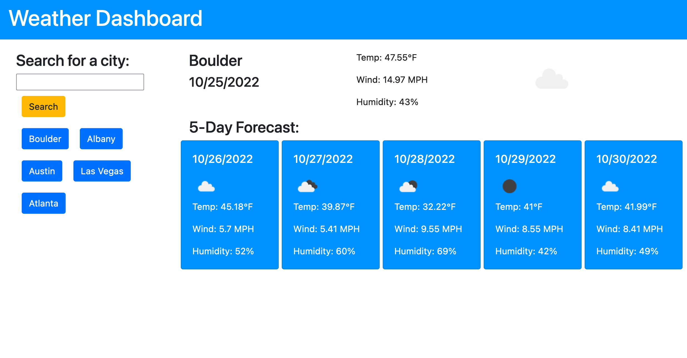

# Weather Dashboard

## Description

A weather app that allows a user to input a city and view the current conditions along with a 5-day forecast. Searched-for cities appear in search history, and can be clicked on to retrieve weather information for that city.

## Deployed App

[https://aberger3647.github.io/weather-dashboard/](https://aberger3647.github.io/weather-dashboard/)

## Screenshots

## Usage
Type any city into the search bar and click "Search" or press enter. To view the weather for a city in the search history, simply click its corresponding button.

